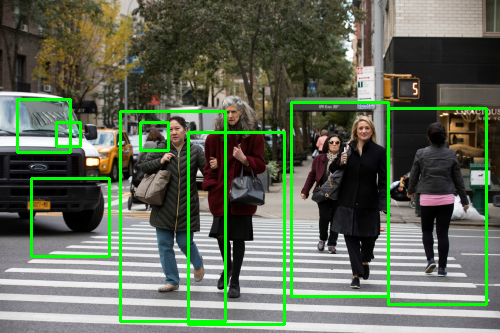

# Python-pedestrian-detection-openCV
The repo contains the implementation of pedestrians detection in Python using OpenCV. The Hog classifier is used here to implement the classification algorithm.

### To get started:
- pip install opencv-python
- pip install imutils

### Output:

